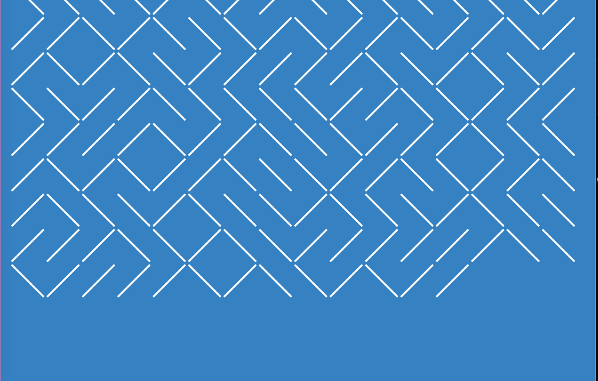

# pattern-generator-animation

[link to project](https://beckaseifert.github.io/pattern-generator-animation/)

This is a coded animation recreation of the classic [10Print animation](https://netart.rocks/uchicago/netart2/10print-variations.html), originally created in Basic. It uses special symbolzes, "／" and "＼" and a "Math.random()" to generate a completely unique maze like pattern. 
